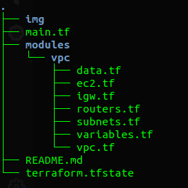

# terraform VPC complete and nat instance

This project create a full VPC configuration with NAT instance, to create this setting, i will use the following feature: 

- EC2
- VPC

### Directory structure

### Explaining the module

* **Module VPC**

This module is responsible for create all VPC configuration, including NAT using an EC2 instance.

* **File main.tf**

File found at the raiz of the project and responsible for calling modules, also has the `provider` settings.

### Initial settings terraform

To use terraform, we first have to configure the file `/home/user/.aws/credentials`. After these settings just run the command below to download terraform dependencies:

> terraform init

### Validating changes

To validate the changes that will be applied, simply execute the command below:

> terraform plan

### Applying the changes

After validation the `plan` command it is time to create all the resources of this project, to do so, run the command below:

> terraform apply

### Removing settings

To remove all  installation performed in the AWS environment, simply run the command:

> terraform destroy

### References

Learn about [Terraform](https://learn.hashicorp.com/terraform)

